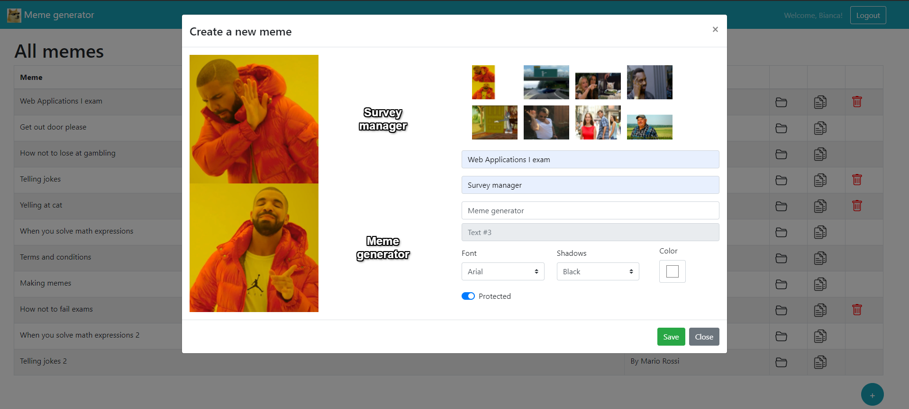

# Exam #2: "Meme Generator"
## Student: s277857 IACOMUSSI BIANCA

## React Client Application Routes

- Route `/memes/all`: lists all the memes in a table if a creator is logged in; it allows to see memes and their properties, to create, delete and copy memes.
- Route `/memes/public`: lists only public memes in a table if login is not performed; it allows to see the public memes and their properties.

## API Server

### Meme Management

#### Get all templates

- GET `/api/templates`
    - Description: Get the full list of templates
    - Request body: _None_
    - Response: `200 OK` (success)
    - Response body: Array of objects, each describing one template:

    ``` JSON
    [
        {
        "template_id": 1,
        "name": "Drake Hotline Bling",
        "box_counts": 2,
        "url": "DrakeHotlineBling.jpg"
    },
    ]
    ```
    - Error responses:  `500 Internal Server Error` (generic error)


#### Get memes

- GET `/api/memes`
    - Description: Get the full list of memes if a creator is logged in, or the list of public memes if not logged in
    - Request body: _None_
    - Request query parameter: _filter_ name of the filter to apply (it can be public or all)
    - Response: `200 OK` (success)
    - Response body: Array of objects, each describing one meme:

    ``` JSON
    [{
        "id": 1,
        "title": "Web Applications I exam", 
        "template_id": 1,
        "text1": "Survey manager",
        "text2": "Meme generator",
        "text3": "",
        "color": "#000000",
        "shadow": "shadow-white",
        "font": "impact",
        "url": "DrakeHotlineBling.jpg",
        "private": 0,
        "username": "Bianca",
        "user_id": 1 
    }]
    ```
    - Error responses:  `500 Internal Server Error` (generic error)


### Add a new meme

- POST `/api/memes`
    - Description: Add a new meme to the memes of the logged user
    - Request body: description of the object to add

    ``` JSON
    {
        "title": "Web Applications II exam", 
        "template_id": 1,
        "text1": "Text 1",
        "text2": "",
        "text3": "",
        "color": "#000000",
        "shadow": "shadow-white",
        "font": "impact",
        "private": 0,
    }
    ```
    - Response: `200 OK` (success)
    - Response body: the object as represented in the database
    - Error responses:  `422 Unprocessable Entity` (values do not satisfy validators), `503 Service Unavailable` (database error)


### Copy an existing meme

- GET `/memes/meme/:id`
    - Description: Get an existing meme that you want to copy corresponding to the id and use its properties (template_id, user_id, private) to check if the copy is valid (the checks are done in the POST below).
    - Request body: _None_
    - Response: `200 OK` (success)
    - Response body: One object describing the required meme:

    ``` JSON
    [{
        "id": 1,
        "title": "Web Applications I exam", 
        "template_id": 1,
        "text1": "Survey manager",
        "text2": "Meme generator",
        "text3": "",
        "color": "#000000",
        "shadow": "shadow-white",
        "font": "impact",
        "private": 0,
        "user_id": 1 
    }]
    ```
    - Error responses:  `500 Internal Server Error` (generic error), `404 Not Found` (not present or unavailable)

- POST `/api/copyMemes`
    - Description: Add the copy to the memes of the logged user
    - Request body: description of the object to add

    ``` JSON
    {
        "title": "Web Applications II exam copy", 
        "template_id": 1,
        "text1": "Text 1 copy",
        "text2": "",
        "text3": "",
        "color": "#000000",
        "shadow": "shadow-white",
        "font": "impact",
        "private": 0,
    }
    ```
    - Response: `200 OK` (success)
    - Response body: the object as represented in the database
    - Error responses:  `422 Unprocessable Entity` (values do not satisfy validators), `503 Service Unavailable` (database error)


### Delete an existing meme

- DELETE `/api/memes/:id`
    - Description: Delete an existing meme of the logged user
    - Request body: _None_
    - Response: `200 OK` (success)
    - Response body: an empty object
    - Error responses:  `500 Internal Server Error` (generic error)


### User management

#### Login

- POST `/api/sessions`
    - Description: authenticate the user who is trying to login
    - Request body: credentials of the user who is trying to login

    ``` JSON
    {
        "username": "username",
        "password": "password"
    }
    ```
    - Response: `200 OK` (success)
    - Response body: authenticated user

    ``` JSON
    {
        "id": 1,
        "username": "bianca@polito.it", 
        "name": "Bianca"
    }
    ```
    - Error responses:  `500 Internal Server Error` (generic error), `401 Unauthorized User` (login failed)


#### Check if user is logged in

- GET `/api/sessions/current`
    - Description: check if current user is logged in and get her data
    - Request body: None
    - Response: `200 OK` (success)
    - Response body: authenticated user

    ``` JSON
    {
        "id": 1,
        "username": "bianca@polito.it", 
        "name": "Bianca"
    }
    ```
    - Error responses:  `500 Internal Server Error` (generic error), `401 Unauthorized User` (user is not logged in)


#### Logout

- DELETE `/api/sessions/current`
    - Description: logout current user
    - Request body: None
    - Response: `200 OK` (success)
    - Response body: None
    - Error responses:  `500 Internal Server Error` (generic error), `401 Unauthorized User` (user is not logged in)


## Database Tables

- Table `users` - contains id email name hash
    Contains the list of users
- Table `sqlite_sequence` - contains name seq
    It is used for autoincrement
- Table `templates` - contains id name box_counts url
    Contains the list of templates
- Table `memes` - contains id title template_id font user_id private color text1 text2 text3 shadow
    Contains the list of memes

## Main React Components

- `MemeList` (in `ContentList.js`): it contains the list of memes which is shown by means of a table. In each row of the table you find the title of a meme, the creator and three buttons: the first one (open folder) opens meme details modal, the second (copy) opens a modal to copy the meme and the last one (trash bin) deletes the meme.

- `Meme` (in `Meme.js`): it is the picture of the meme: it consists on the template image with the text fields on it.

- `OpenButton` (in `OpenButton.js`): when clicking on this button, a modal opens. The modal shows all the properties of a meme: the meme per se (template with text fields on it), the title, the creator name and eventually an icon of a lock if the meme is protected.

- `AddButton` (in `AddButton.js`): the button allows to open a modal for create a new meme. In this modal you have on the left an overview of the meme and on the right the input fields for the properties of the meme (possible templates, title, text1, text2, text3, font, color, shadow, protected).

- `CopyButton` (in `CopyButton.js`): this button opens a modal to copy a meme. Copying a meme is like adding a new one but you cannot change the template and in some cases nore the protected field, so you need extra checks and some modifications (you cannot choose from the possibile templates and the protected Check is disabled in some cases).

- `Navigation` (in `Navigation.js`): component that shows the navbar. It has the sitename with site icon (clicking on it you will return home), a message to the user (present only if the user is logged in) and a login/logout button.

- `LoginForm` (in `Login.js`): it is a form that allows to enter username and password in the login.


## Screenshot



## Users Credentials
Username, password, name:
- bianca@polito.it, Bianca1234, Bianca
- della@yahoo.it, Della97, Della
- mario.rossi@gmail.com, Mario78, Mario Rossi


## Memes Created By Each Creator
- Bianca created:
    - "Web Applications I exam"
    - "Telling jokes"
    - "Yelling at cat"
    - "How not to fail exams", copied from "How not to lose at gambling" by Mario Rossi.
- Della created:
    - "When you solve math expressions"
    - "Making memes"
    - "When you solve math expressions 2", copied from "When you solve math expressions" by Della.
- Mario Rossi created:
    - "Get out door please"
    - "How not to lose at gambling"
    - "Telling jokes 2", copied from "Telling jokes" by Bianca.
